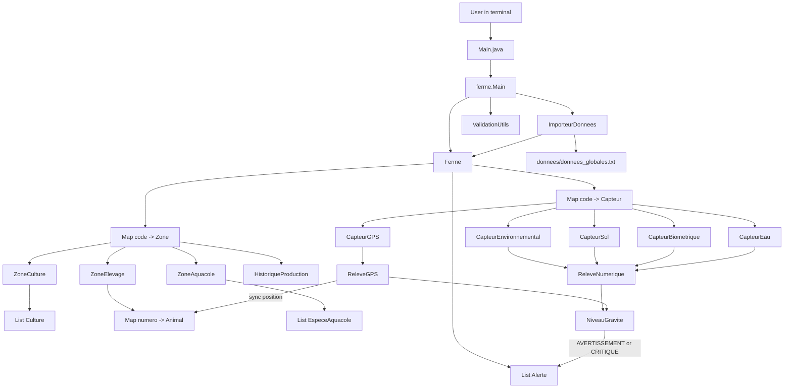
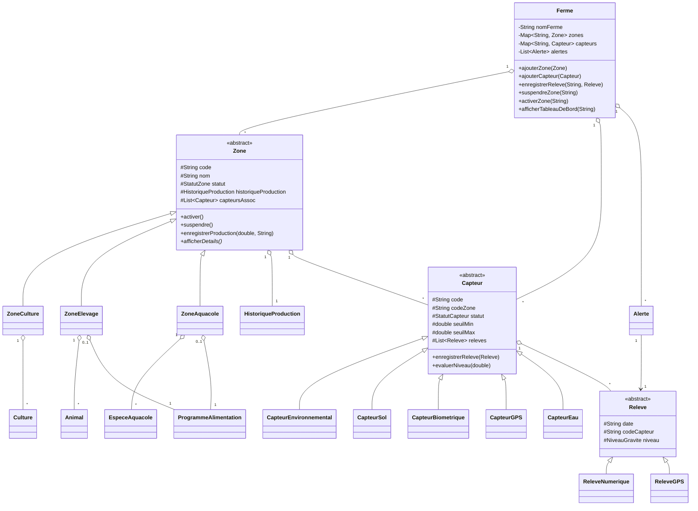
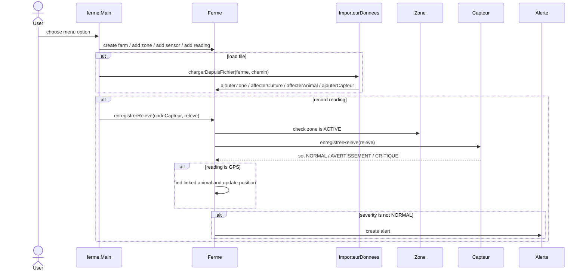
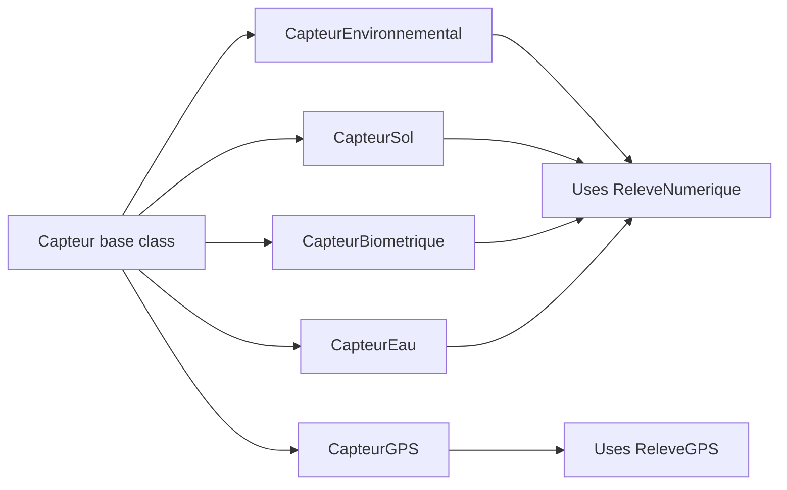
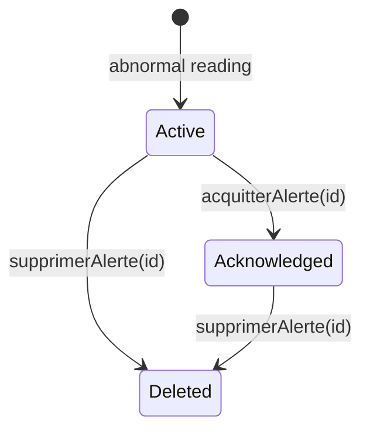

# Smart Farm Management Project Summary

This project is a Java console application for managing an intelligent farm. The user interacts through menus, creates or loads a `Ferme`, then manages zones, cultures, animals, sensors, readings, production history, dashboards, and alerts.

## Project Tree

```text
tpPOO/
|-- Main.java                         # Thin launcher: calls ferme.Main.main(args)
|-- sources.txt                       # Source list from the original Windows path
|-- PROJECT_SUMMARY.md                # This project map
|-- bin/                              # Compiled output directory, if used
|-- Main.class                        # Existing compiled launcher
|-- donnees/
|   |-- donnees_globales.txt          # Full sample import file
|   |-- donees_globales.txt           # Similar/alternate global data file
|   |-- capteurs.txt                  # Sensor import data
|   |-- releves_numeriques.txt        # Numeric readings import data
|   `-- releves_gps.txt               # GPS readings import data
`-- ferme/
    |-- Main.java                     # Console menu and user input orchestration
    |-- Ferme.java                    # Central domain service/state container
    |-- ImporteurDonnees.java         # Global data file importer
    |-- ValidationUtils.java          # Date and numeric validation helpers
    |-- TypeAnimaux.java              # Legacy animal type enum
    |-- enums/
    |   |-- EtatSante.java
    |   |-- FamilleCulture.java
    |   |-- NiveauGravite.java
    |   |-- StadeCroissance.java
    |   |-- StatutCapteur.java
    |   |-- StatutZone.java
    |   |-- TypeCapteurBio.java
    |   |-- TypeCapteurEau.java
    |   |-- TypeCapteurEnv.java
    |   |-- TypeCapteurSol.java
    |   `-- TypeElevage.java
    `-- models/
        |-- Zone.java                 # Abstract base class for farm zones
        |-- ZoneCulture.java
        |-- ZoneElevage.java
        |-- ZoneAquacole.java
        |-- Capteur.java              # Abstract base class for sensors
        |-- CapteurEnvironnemental.java
        |-- CapteurSol.java
        |-- CapteurBiometrique.java
        |-- CapteurGPS.java
        |-- CapteurEau.java
        |-- Releve.java               # Abstract base class for readings
        |-- ReleveNumerique.java
        |-- ReleveGPS.java
        |-- Alerte.java
        |-- Animal.java
        |-- Culture.java
        |-- EspeceAquacole.java
        |-- ExigencesPedologiques.java
        |-- HistoriqueProduction.java
        |-- PositionGPS.java
        `-- ProgrammeAlimentation.java
```

## High-Level Web Of The Application



## Domain Class Diagram



## Main Runtime Flow



## Detailed Flow: Sensors, Readings, And Alerts

The sensor/alert system starts when a sensor is created and attached to a zone. Every sensor has:

- `code`: unique sensor identifier, for example `ENV01` or `GPS01`
- `codeZone`: the zone where the sensor is installed
- `statut`: `ACTIF`, `SUSPENDU`, or `DEFAILLANT`
- `seuilMin` and `seuilMax`: accepted range for numeric sensors
- `releves`: the history of accepted readings

When `Ferme.ajouterCapteur(capteur)` is called, the sensor is stored in `Ferme.capteurs`. If the target zone already exists, the sensor is also attached to the zone through `zone.ajouterCapteurAssoc(capteur)`. This association is important because suspending or reactivating a zone also changes its associated sensors.

### Sensor Types



Numeric sensors:

- `CapteurEnvironnemental`: temperature, humidity, rainfall.
- `CapteurSol`: pH, soil humidity, nitrogen.
- `CapteurBiometrique`: animal body temperature or activity. It also stores `numeroAnimal`.
- `CapteurEau`: water temperature, dissolved oxygen, water pH.

GPS sensors:

- `CapteurGPS`: linked to one animal by `numeroAnimal`.
- It stores a reference center position and a radius.
- It accepts only `ReleveGPS`, not numeric readings.

### Reading Registration Flow

```mermaid
flowchart TD
    Start[User enters reading or imports file] --> Main[ferme.Main]
    Main --> FarmCall[Ferme.enregistrerReleve(codeCapteur, releve)]
    FarmCall --> FindSensor{Sensor exists?}
    FindSensor -->|No| RejectSensor[Reject reading]
    FindSensor -->|Yes| FindZone{Sensor zone exists?}
    FindZone -->|No| RejectZone[Reject reading]
    FindZone -->|Yes| ZoneActive{Zone ACTIVE?}
    ZoneActive -->|No| RejectSuspended[Reject reading]
    ZoneActive -->|Yes| SensorStore[capteur.enregistrerReleve(releve)]

    SensorStore --> Compatible{Reading compatible with sensor?}
    Compatible -->|No| RejectType[Reject reading]
    Compatible -->|Yes| Eval[Evaluate severity]
    Eval --> Store[Store reading in sensor history]
    Store --> GPSCheck{GPS reading?}
    GPSCheck -->|Yes| SyncAnimal[Update linked animal position]
    GPSCheck -->|No| SeverityCheck
    SyncAnimal --> SeverityCheck{Severity NORMAL?}
    SeverityCheck -->|Yes| Done[No alert]
    SeverityCheck -->|No| Alert[Create Alerte and add to Ferme.alertes]
```

The main method that coordinates this is `Ferme.enregistrerReleve(String codeCapteur, Releve releve)`. It performs these checks in order:

1. Find the sensor in `capteurs`.
2. Find the zone using the sensor's `codeZone`.
3. Reject the reading if the zone is not `ACTIVE`.
4. Delegate the reading to `capteur.enregistrerReleve(releve)`.
5. If the reading is GPS, update the linked animal's current position.
6. If the reading severity is not `NORMAL`, generate an alert.

### Numeric Sensor Severity Logic

For normal numeric sensors, `Capteur.enregistrerReleve(releve)` rejects GPS readings and evaluates the numeric value with `evaluerNiveau(double valeur)`.

The rule is:

```text
if value is between seuilMin and seuilMax:
    severity = NORMAL
else:
    difference = distance outside the allowed range
    range = seuilMax - seuilMin
    if difference / range > 0.5:
        severity = CRITIQUE
    else:
        severity = AVERTISSEMENT
```

Example with sensor thresholds `[10 - 35]`:

```text
value = 24  -> NORMAL
value = 40  -> AVERTISSEMENT, because it is outside the range but not too far
value = 55  -> CRITIQUE, because it is far outside the range
```

After the severity is computed, the reading is stored in the sensor's `releves` list. The reading itself keeps the severity in `Releve.niveau`.

### GPS Sensor Severity Logic

`CapteurGPS` overrides `enregistrerReleve` because GPS data is different from numeric data.

It rejects non-GPS readings. For a `ReleveGPS`, it calculates the distance between:

- the sensor's reference center: `latitude`, `longitude`
- the reading's position: `PositionGPS`

The rule is:

```text
if distance <= rayonZoneMetres:
    severity = NORMAL
else if distance <= rayonZoneMetres * 1.5:
    severity = AVERTISSEMENT
else:
    severity = CRITIQUE
```

After a valid GPS reading is stored, `Ferme.synchroniserPositionAnimalSiGPS` looks up the linked animal by `CapteurGPS.numeroAnimal` and updates `animal.positionActuelle`.

### Alert Creation

Alerts are not created manually. They are generated automatically by `Ferme.genererAlerte(releve, capteur)` when:

```text
releve.getNiveau() != NiveauGravite.NORMAL
```

Each `Alerte` stores:

- auto-incremented `id`
- the original `Releve`
- `niveau`: `AVERTISSEMENT` or `CRITIQUE`
- `codeZone`: copied from the sensor's zone
- `acquittee`: starts as `false`
- `dateCreation`: copied from the reading date

The alert is then appended to `Ferme.alertes`, unless the maximum number of alerts, `MAX_ALERTES = 500`, has already been reached.

### Alert Lifecycle



Alert operations in `Ferme`:

- `afficherPanneauAlertes()`: displays all alerts.
- `afficherAlertesActives()`: displays only alerts where `acquittee == false`.
- `acquitterAlerte(id)`: marks an alert as acknowledged, but keeps it in history.
- `supprimerAlerte(id)`: removes the alert from the list.
- `afficherAlertesTrierParGravite()`: sorts alerts by severity and displays them.
- `consulterHistoriqueAlertes(...)`: filters by zone, severity, sensor type, or date range.

### Zone Suspension Effect

Zone status directly affects sensors and readings:

```mermaid
flowchart TD
    Suspend[Ferme.suspendreZone(codeZone)] --> ZoneSusp[zone.suspendre()]
    ZoneSusp --> SensorsSusp[associated sensors become SUSPENDU]
    SensorsSusp --> LaterReading[future readings are ignored]

    Activate[Ferme.activerZone(codeZone)] --> ZoneActive[zone.activer()]
    ZoneActive --> SensorsActive[associated non-defective sensors become ACTIF]
```

When a zone is suspended:

1. The zone status becomes `SUSPENDUE`.
2. Associated sensors become `SUSPENDU`.
3. `Ferme.enregistrerReleve` rejects future readings for that zone before severity evaluation.

When a zone is reactivated:

1. The zone status becomes `ACTIVE`.
2. Associated sensors are reactivated unless they are `DEFAILLANT`.

### Example End-To-End Scenario

```text
1. CAPTEUR_ENV;ENV01;ZC01;TEMPERATURE;10;35 creates a temperature sensor in zone ZC01.
2. A reading NUM;ENV01;40;C;2026-05-20-10h is loaded.
3. Ferme finds ENV01, then finds zone ZC01.
4. If ZC01 is ACTIVE, the reading is passed to ENV01.
5. ENV01 compares 40 against thresholds [10 - 35].
6. 40 is outside the range, so the reading becomes AVERTISSEMENT.
7. Ferme sees the severity is not NORMAL.
8. Ferme creates an active alert linked to zone ZC01 and reading ENV01.
9. The alert appears in the alert panel until it is acknowledged or deleted.
```

## How It Works

1. `Main.java` at the repository root is only a compatibility launcher. It delegates execution to `ferme.Main`.
2. `ferme.Main` displays the console menus, reads user input, validates dates/numbers/enums, and calls methods on the current `Ferme`.
3. `Ferme` is the central object. It stores:
   - zones in `Map<String, Zone>`
   - sensors in `Map<String, Capteur>`
   - alerts in `List<Alerte>`
4. Zones are polymorphic:
   - `ZoneCulture` stores `Culture` objects and reports growth stages/families.
   - `ZoneElevage` stores `Animal` objects, GPS center/radius, and optional feeding program.
   - `ZoneAquacole` stores aquaculture species and optional feeding program.
5. Sensors are also polymorphic:
   - environmental, soil, biometric, and water sensors use numeric thresholds.
   - GPS sensors compare a `ReleveGPS` position with a zone center/radius.
6. Readings are stored inside their sensor. When a reading is outside thresholds, it receives a `NiveauGravite`.
7. `Ferme.enregistrerReleve` creates an `Alerte` when the severity is `AVERTISSEMENT` or `CRITIQUE`.
8. Suspending a zone also suspends associated sensors. A suspended zone rejects new readings.
9. Production is recorded per zone through `HistoriqueProduction`.
10. `ImporteurDonnees` can build the farm from semicolon-separated files in `donnees/`.

## Important Data Files

```text
donnees/donnees_globales.txt
  Creates zones, cultures, animals, and sensors in one file.

donnees/capteurs.txt
  Loads sensors separately through the Capteurs menu.

donnees/releves_numeriques.txt
  Loads numeric sensor readings.

donnees/releves_gps.txt
  Loads GPS sensor readings.
```

Example global import line formats are documented at the top of `donnees/donnees_globales.txt`, such as:

```text
ZONE_CULTURE;code;nom
ZONE_ELEVAGE;code;nom;TypeElevage;latitude;longitude;surface
CULTURE;codeZone;nom;FamilleCulture;datePlantation;dateRecolte;phMin;phMax;humMin;humMax
ANIMAL;codeZone;numero;espece;TypeElevage;age;poids;EtatSante
CAPTEUR_GPS;code;codeZone;numeroAnimal;latitude;longitude;rayon
```

## Run And Use

Compile all Java files from the project root:

```bash
javac Main.java ferme/*.java ferme/enums/*.java ferme/models/*.java
```

Run the console application:

```bash
java Main
```

Recommended manual flow:

```text
1. Create a farm from menu option 1.
2. Load sample global data with option 10 and path donnees/donnees_globales.txt.
3. Use dashboards, alerts, zones, cultures, animals, and readings menus.
4. Load readings from donnees/releves_numeriques.txt or donnees/releves_gps.txt.
```

## Key Design Points

- The project uses inheritance for the major domain families: `Zone`, `Capteur`, and `Releve`.
- `Ferme` acts like the application service layer and coordinates cross-object rules.
- Enums keep the domain values controlled: health states, sensor states, zone states, severity levels, culture families, growth stages, and sensor subtypes.
- Alerts are generated automatically from abnormal readings instead of being entered manually.
- The code is local and console-based; there is no HTTP server or browser web layer.
