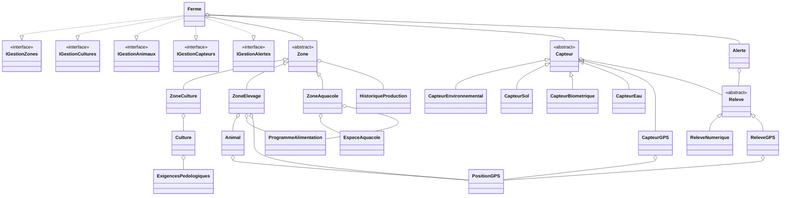

# Rapport - ESI Smart Farming

## 1. Conception generale

L'application modelise une ferme intelligente composee de zones geographiques. Une zone est abstraite et specialisee en zone de culture, zone d'elevage ou zone aquacole. La classe `Ferme` centralise les operations de gestion et implemente les interfaces fonctionnelles du systeme.

Les capteurs sont modelises par une classe abstraite `Capteur`, specialisee selon la nature du releve : environnement, sol, biometrie, eau et GPS. Chaque releve est evalue par rapport aux seuils du capteur. Si la valeur sort de la plage autorisee, une alerte est creee automatiquement avec un niveau de gravite.

## 2. Diagramme de classes

## 3. Tableau des classes

| Classe | Attributs principaux | Methodes principales |
|---|---|---|
| `Ferme` | `String nomFerme`, `Zone[] zones`, `Capteur[] capteurs`, `Alerte[] alertes` | `boolean ajouterZone(Zone zone)`, `boolean affecterCultureAZone(String codeZone, Culture culture)`, `boolean affecterAnimalAZone(String codeZone, Animal animal)`, `boolean ajouterCapteur(Capteur capteur)`, `boolean enregistrerReleve(String codeCapteur, Releve releve)`, `void afficherPanneauAlertes()` |
| `Zone` abstraite | `String code`, `String nom`, `StatutZone statut`, `HistoriqueProduction historiqueProduction` | `void activer()`, `void suspendre()`, `void enregistrerProduction(double valeur, String date)`, `abstract String getTypeZone()`, `abstract int getNombreEntites()`, `abstract void afficherDetails()` |
| `ZoneCulture` | `Culture[] cultures`, `int nbCultures` | `boolean ajouterCulture(Culture culture)`, `Culture getCulture(int index)`, `void genererRapport()` |
| `ZoneElevage` | `TypeElevage typeElevage`, `Animal[] animaux`, `ProgrammeAlimentation programmeAlimentation`, `PositionGPS centreZone`, `double rayonZoneMetres` | `boolean ajouterAnimal(Animal animal)`, `Animal rechercherAnimalParNumero(int numero)`, `void setProgrammeAlimentation(ProgrammeAlimentation programme)` |
| `ZoneAquacole` | `EspeceAquacole[] especes`, `int nbEspeces`, `ProgrammeAlimentation programmeAlimentation` | `boolean ajouterEspece(EspeceAquacole espece)`, `int getNombreTotalAnimaux()`, `void setProgrammeAlimentation(ProgrammeAlimentation programme)` |
| `Culture` | `String nom`, `FamilleCulture famille`, `String datePlantation`, `String dateRecoltePrevue`, `StadeCroissance stadeActuel`, `ExigencesPedologiques exigences` | `void setStadeActuel(StadeCroissance stade)`, `void setDateRecoltePrevue(String date)` |
| `Animal` | `int numero`, `String espece`, `TypeElevage typeElevage`, `int age`, `double poids`, `EtatSante etatSante`, `PositionGPS positionActuelle` | `void setEtatSante(EtatSante etat)`, `void setPositionActuelle(PositionGPS pos)`, `boolean ajouterEvenementSanitaire(String date, String description)`, `boolean enregistrerPoids(String date, double nouveauPoids)` |
| `Capteur` abstraite | `String code`, `String codeZone`, `StatutCapteur statut`, `double seuilMin`, `double seuilMax`, `Releve[] releves` | `boolean enregistrerReleve(Releve releve)`, `NiveauGravite evaluerNiveau(double valeur)`, `abstract String getTypeCapteur()`, `abstract String getUnite()`, `void afficherHistorique(String dateDebut, String dateFin)`, `void afficherGraphique()` |
| `CapteurEnvironnemental` | `TypeCapteurEnv type` | `String getTypeCapteur()`, `String getUnite()` |
| `CapteurSol` | `TypeCapteurSol type` | `String getTypeCapteur()`, `String getUnite()` |
| `CapteurBiometrique` | `TypeCapteurBio type`, `int numeroAnimal` | `String getTypeCapteur()`, `String getUnite()`, `int getNumeroAnimal()` |
| `CapteurEau` | `TypeCapteurEau type` | `String getTypeCapteur()`, `String getUnite()` |
| `CapteurGPS` | `int numeroAnimal`, `double latitude`, `double longitude`, `double rayonZoneMetres` | `boolean estDansZone(PositionGPS position)`, `NiveauGravite evaluerPositionGPS(PositionGPS position)`, `boolean enregistrerReleve(Releve releve)` |
| `Releve` abstraite | `String date`, `String codeCapteur`, `NiveauGravite niveau` | `void setNiveau(NiveauGravite niveau)`, `abstract boolean estGPS()`, `double getValeur()`, `String getUnite()`, `PositionGPS getPosition()` |
| `ReleveNumerique` | `double valeur`, `String unite` | `boolean estGPS()`, `double getValeur()`, `String getUnite()` |
| `ReleveGPS` | `PositionGPS position` | `boolean estGPS()`, `PositionGPS getPosition()`, `String getUnite()` |
| `Alerte` | `int id`, `Releve releve`, `NiveauGravite niveau`, `String codeZone`, `boolean acquittee`, `String dateCreation` | `void acquitter()`, `boolean estAcquittee()` |
| `HistoriqueProduction` | `String[] dates`, `double[] valeurs`, `String unite`, `int nbEntrees` | `boolean ajouterEntree(String date, double valeur)`, `double moyenneProduction()`, `void afficher()` |
| `ProgrammeAlimentation` | `String typeAliment`, `double quantiteParRepas`, `int nombreRepasParJour` | `double quantiteTotaleJournaliere()` |
| `PositionGPS` | `double latitude`, `double longitude` | `double distanceVers(PositionGPS autre)` |
| `ExigencesPedologiques` | `double phMin`, `double phMax`, `double humiditeMin`, `double humiditeMax` | `boolean phDansPlage(double ph)`, `boolean humiditeDansPlage(double humidite)` |
| `EspeceAquacole` | `String nom`, `int nombreAnimaux` | `void setNombreAnimaux(int n)` |

## 4. Enumerations

| Enumeration | Valeurs |
|---|---|
| `StatutZone` | `ACTIVE`, `SUSPENDUE` |
| `TypeElevage` | `RUMINANT`, `VOLAILLE` |
| `EtatSante` | `SAIN`, `MALADE`, `QUARANTAINE` |
| `FamilleCulture` | `CEREALE`, `LEGUME`, `FRUIT` |
| `StadeCroissance` | `SEMIS`, `GERMINATION`, `CROISSANCE`, `MATURITE`, `RECOLTE` |
| `StatutCapteur` | `ACTIF`, `DEFAILLANT`, `SUSPENDU` |
| `NiveauGravite` | `NORMAL`, `AVERTISSEMENT`, `CRITIQUE` |
| `TypeCapteurEnv` | `TEMPERATURE`, `HUMIDITE`, `PLUVIOMETRIE` |
| `TypeCapteurSol` | `PH`, `HUMIDITE_SOL`, `AZOTE` |
| `TypeCapteurBio` | `TEMPERATURE_CORPORELLE`, `ACTIVITE` |
| `TypeCapteurEau` | `TEMPERATURE_EAU`, `OXYGENE_DISSOUS`, `PH_EAU` |

## 5. Fonctions couvertes

- Gestion des zones : ajout, modification, activation, suspension, production et vue d'ensemble.
- Gestion des cultures : ajout, affectation, stade de croissance et rapport par zone.
- Gestion des animaux : ajout avec etat de sante initial, unicite du numero, evenements sanitaires, evolution du poids et alimentation.
- Gestion des capteurs : ajout, configuration des seuils, changement de statut, historique et graphiques. Un capteur n'enregistre un relevé que si sa zone est active.
- Gestion GPS : controle de sortie de zone et mise a jour de la position actuelle de l'animal.
- Gestion des alertes : creation automatique, tri par gravite, affichage, acquittement, suppression et historique filtre.
